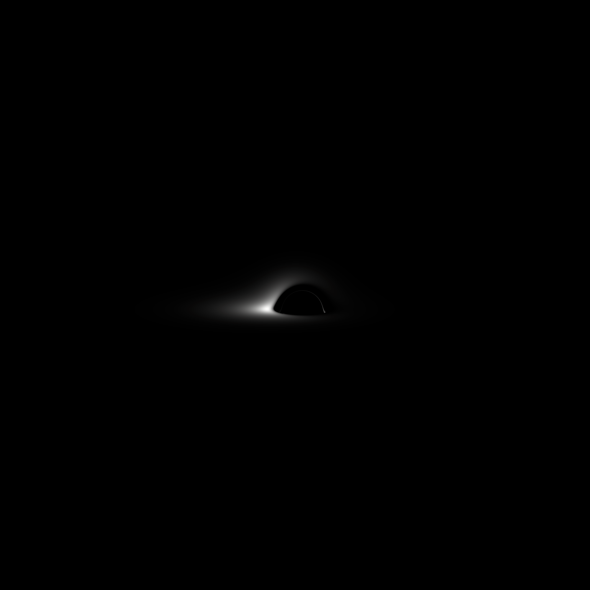

# bhsim

This repository aims to recreate the main results from Luminet, J.P. AAP, 75,
228-235 (1979). A few points of interest include

- `out.py` contains functions for generating isoradial plots, which show how
  luminous rings of matter at different distances from the singularity appear
  distorted by the extreme gravity of the black hole, as seen by a distant
  observer.
- `benchmark.py` contains benchmarking functions for the project. Calculating
  isoradials takes time, and I've worked to push as much of the calculation onto
  numpy as I can. On my laptop I can produce ~1 isoradial/second including the
  direct image as well as two ghost images.

## Roadmap

I plan to keep adding to the project until I can plot Fig 11 from Luminet's
paper.

## Related

- See https://github.com/bgmeulem/Luminet for another implementation. I found
  the figures there useful to compare with my own output.
